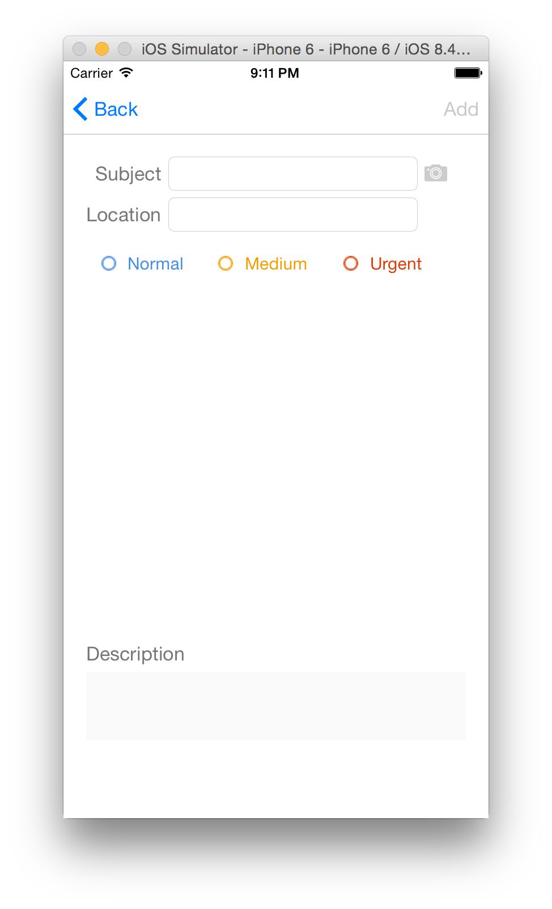
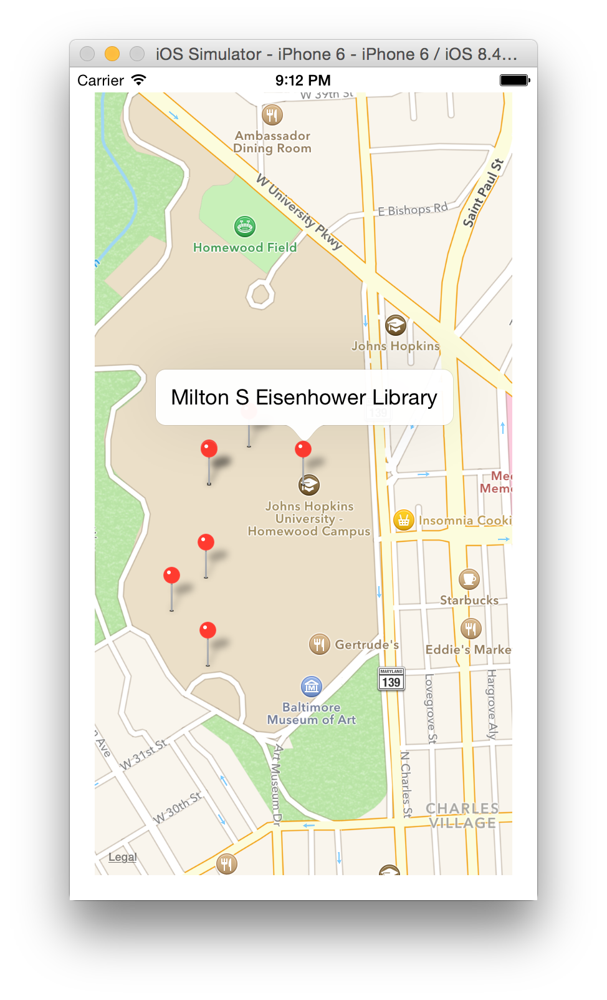
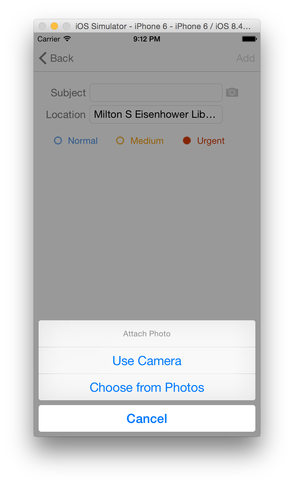
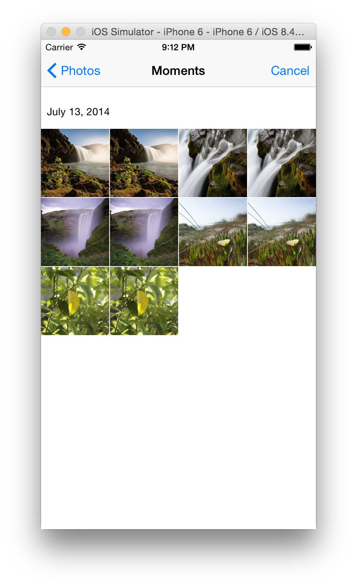
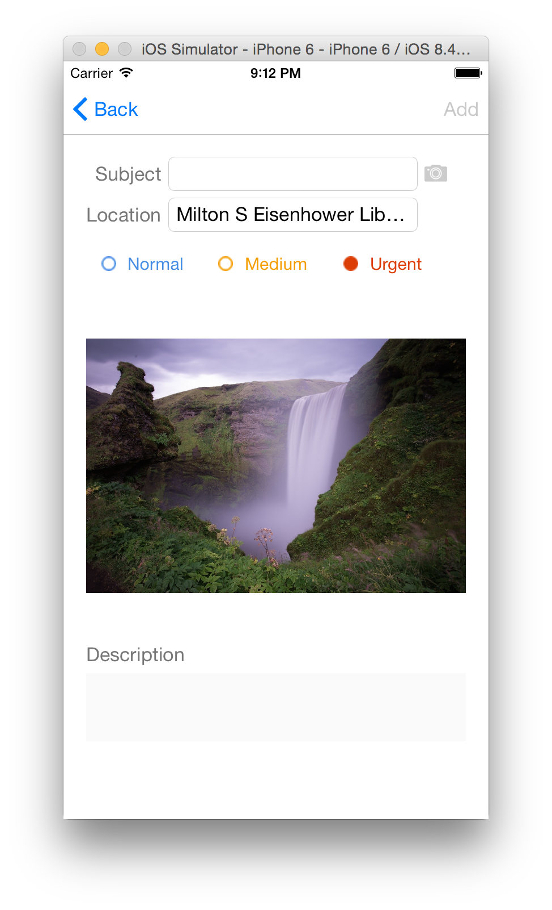
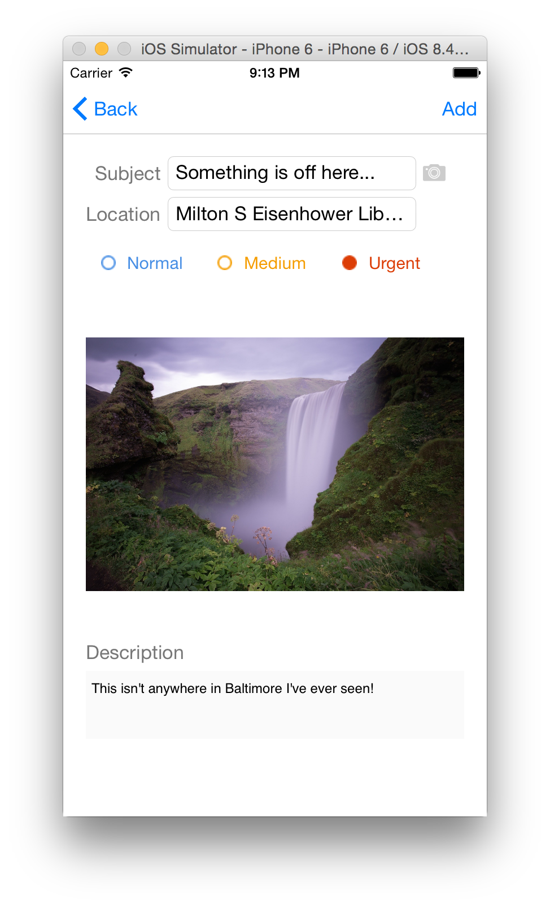

# Issues

This is a simple mobile app demo that allows people to submit issues they find and tag them by location.
For example, they might report a broken window or a water fountain not working.

## Running it

You'll need to grab the server component, [xfissues-rails](https://github.com/bratsche/xfissues-rails) and follow
the instructions there.

### Screenshots

